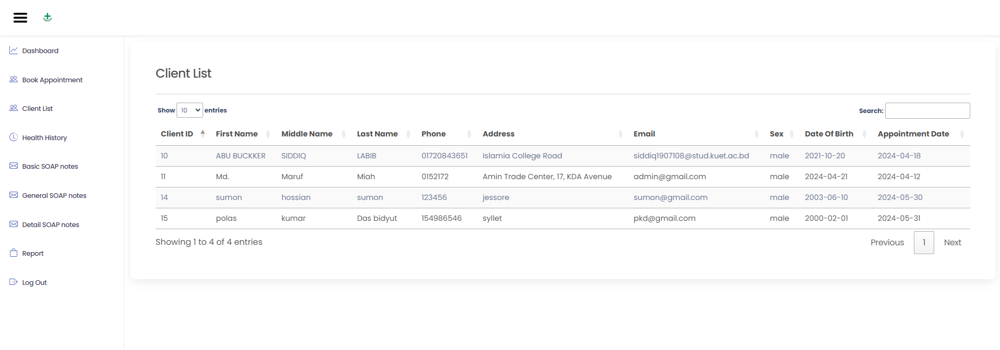

# Patient Management System (PMS)

The Patient Management System (PMS) is a comprehensive solution for doctors to streamline their workflow and enhance patient care. This system offers a range of features including secure administrator login, appointment scheduling, a detailed client list, patient health history management, Soap Notes Management and Report Generation, 

## Features

### Secure Administrator Login
- Ensures that only authorized personnel can access the system.
- Utilizes robust authentication mechanisms to safeguard sensitive patient information.

### Appointment Scheduling
- Simplifies the process of booking and managing appointments.
- Provides an intuitive calendar interface for easy scheduling and rescheduling.

### Comprehensive Client List
- Maintains a detailed list of all patients.
- Allows for quick retrieval of patient information.
- Quick search of patient information.

### Patient Health History
- Enables the addition and management of detailed patient health histories.
- Supports various formats of SOAP notes (basic, general, and detailed) to document patient interactions accurately.

### Automated Report Generation
- Generates reports automatically, reducing administrative burden.
- Ensures accuracy and efficiency in patient care documentation.

## Images

